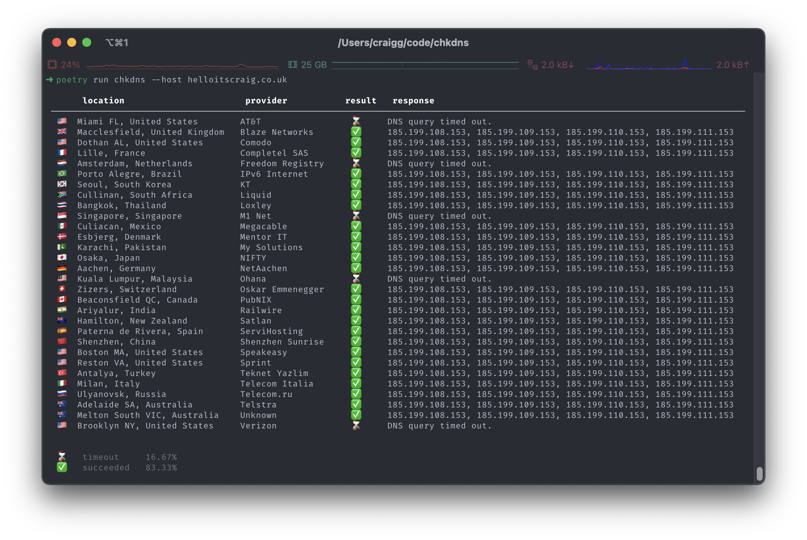

# chkdns

 [](https://badge.fury.io/py/chkdns)

Harness the power of [whatsmydns](https://whatsmydns.net) from the command-line.

[]

## Installing with pip

```bash
pip install chkdns
```

## Run

```bash
chkdns --host github.com
```

Alternatively you can run with docker:

```bash
docker run -rm -it ghcr.io/chelnak/chkdns:latest --host github.com
```

## Develop

### Install dependencies

Install dependencies with poetry:

```bash
poetry install
```

### Building

To keep local builds consistent with ci, use make to build and lint:

```bash
make build
```

### Install pre commit hooks

The project uses [pre-commit](https://pre-commit.com/) for commit time checking. You can find the configuration [here](.pre-commit-config.json).

```bash
pre-commit install
```

### Releasing stuff

Releasing is a semi manual but well oiled method. Tags are used to trigger the release steps in the ci process.

Running the following make command will tag and push the latest commit triggering a release.

```bash
make tag version="v0.0.5"
```

> Note: Releases can only be generated from the main branch.

### Runing locally

You can either build a new package using `make build` and install it or run the package directly:

```bash
poetry run chkdns
```
